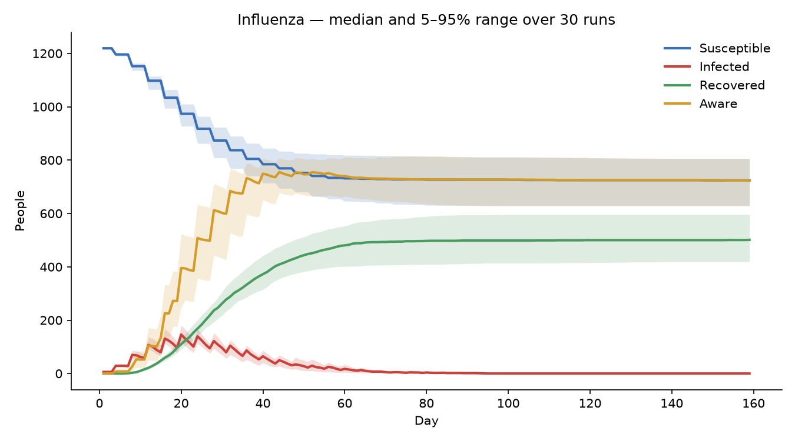

# EpidemicFlow

**A behavioural, agent-based epidemic simulator in Python.** Each cell of an N×N grid is one person who moves between seven health and behaviour states. Infection spreads through local contact, and people can become aware (lowering their risk) or quarantine, so behaviour and disease feed back on each other.



[](https://github.com/MohmdFahad/EpidemicFlow/actions/workflows/tests.yml)

## Quick start

```bash
git clone https://github.com/MohmdFahad/EpidemicFlow.git
cd EpidemicFlow
pip install -e ".[plot]"

epidemicflow --scenario influenza --seed 1             # one reproducible run
epidemicflow --scenario covid --runs 30 --plot covid.png  # 30 runs: mean, spread and a plot
epidemicflow --help                                    # every parameter can be overridden
```

Or from Python:

```python
from epidemicflow import SCENARIOS, run_simulation, format_summary

result = run_simulation(SCENARIOS["measles"], seed=42)
print(format_summary(result))
result.log          # pandas DataFrame, one row per day
```

## The model

| State | Meaning |
|---|---|
| 0 Susceptible | healthy, unaware |
| 1 Infected | infected and spreading |
| 2 Recovered | immune for the rest of the run |
| 3 Susceptible, quarantined | isolating; 90% lower infection risk |
| 4 Susceptible, aware | protective behaviour; risk reduced by `awareness_efficacy` |
| 5 Infected, aware | spreads at 30% of the normal rate |
| 6 Infected, quarantined | does not spread |

Each day: quarantines count down, infected people surrounded by infection may quarantine, awareness spreads (locally through neighbours and globally through campaigns), infection spreads to the 8 neighbouring cells, and people recover.

- **Awareness adoption** is a sigmoid of the share of aware neighbours and the infection level.
- **Recovery time** is Gamma-distributed with the chosen mean and variance.
- **Spread timing** – infection and awareness spread in events every *n* days, where *n* adapts to current infection and awareness levels.

Full equations: [docs/model_description.md](docs/model_description.md).

## Results (30 runs per scenario)

| Scenario | Total infected (attack rate) | Peak active infections | Peak day | Duration (days) |
|---|---|---|---|---|
| Influenza-like (35×35) | 42% ± 5% | 150 ± 19 | 21 ± 3 | 99 ± 21 |
| COVID-like (40×40) | 86% ± 4% | 389 ± 72 | 30 ± 5 | 138 ± 31 |
| Measles-like (30×30) | 94% ± 1% | 307 ± 34 | 19 ± 2 | 93 ± 23 |

Mean ± standard deviation across seeds 0–29. Parameters for each scenario are in [`params.py`](src/epidemicflow/params.py); details in [docs/results_summary.md](docs/results_summary.md).

## Limitations

- Parameters are hand-tuned to give plausible curve shapes; the model is **not calibrated** against real outbreak data.
- Contact is purely local (8 neighbours, no long-range travel); no loss of immunity.
- Spread happens in periodic events, which makes the daily curves step-shaped.

## Development

```bash
pip install -e ".[dev]"
pytest
```

Tests cover reproducibility (same seed, same result), population conservation, edge and corner neighbourhoods, quarantine timing and the summary statistics. They run on every push via GitHub Actions.

```
src/epidemicflow/
  params.py        parameters, validation and preset scenarios
  grid_utils.py    states, grid set-up, neighbour helpers
  infection.py     infection spread and recovery
  awareness.py     local and global awareness
  simulation.py    daily loop, results and summary
  experiments.py   multi-seed runs and plots
  cli.py           command-line interface
tests/             pytest suite
```

## Licence

See [LICENSE](LICENSE).
