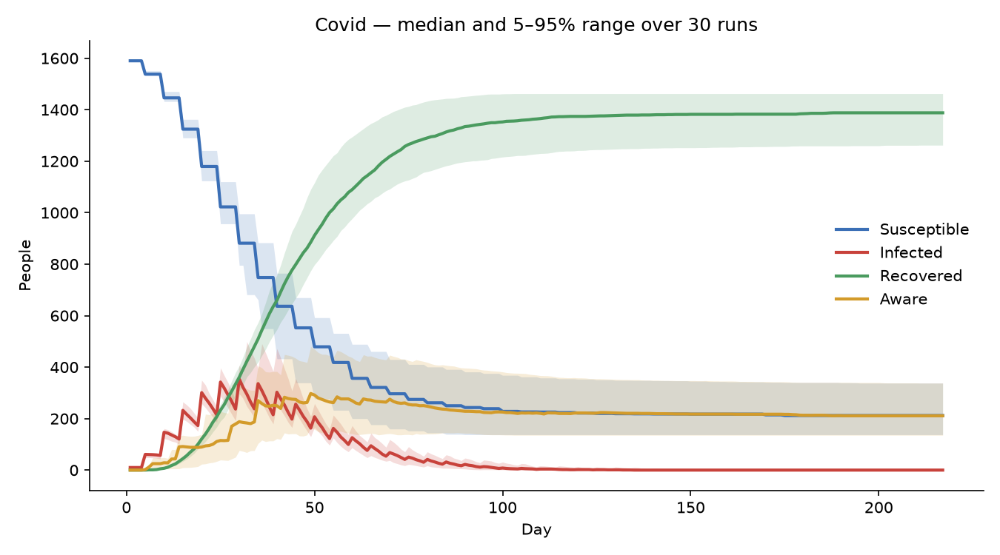
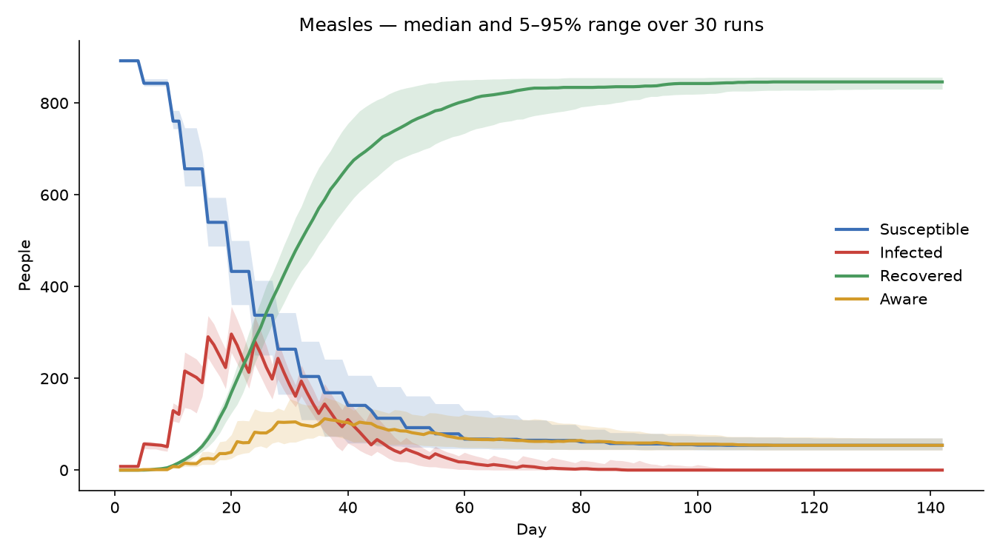

# EpidemicFlow – Results Summary

All results are from **30 runs per scenario (seeds 0–29)**. A single run is one random outcome. Runs with identical parameters vary a lot, so results are reported as mean, standard deviation and the 5th–95th percentile range.

Reproduce everything on this page with:

```bash
python examples/run_scenarios.py
```

## Scenarios

| Scenario | Infection prob | Awareness rate | Awareness efficacy | Quarantine prob | Recovery mean / var | Grid | Initial infections |
|---|---|---|---|---|---|---|---|
| Influenza-like | 0.55 | 0.45 | 0.35 | 0.60 | 8 / 4 | 35×35 | 6 |
| COVID-like | 0.70 | 0.30 | 0.30 | 0.70 | 10 / 9 | 40×40 | 10 |
| Measles-like | 0.85 | 0.20 | 0.20 | 0.40 | 9 / 9 | 30×30 | 8 |

## Results

| Metric (mean ± sd, [5th–95th pct]) | Influenza-like | COVID-like | Measles-like |
|---|---|---|---|
| Attack rate (share ever infected) | 42% ± 5% [34–49%] | 86% ± 4% [79–91%] | 94% ± 1% [92–95%] |
| Peak active infections | 150 ± 19 [118–181] | 389 ± 72 [304–504] | 307 ± 34 [257–357] |
| Day of peak | 21 ± 3 | 30 ± 5 | 19 ± 2 |
| Epidemic duration (days) | 99 ± 21 [77–136] | 138 ± 31 [102–201] | 93 ± 23 [63–130] |
| People who became aware | 982 ± 35 | 725 ± 139 | 295 ± 40 |
| People who quarantined | 187 ± 21 | 757 ± 87 | 458 ± 22 |

## Plots

Median curve and 5–95% band across the 30 runs.





## Observations

- **Higher transmissibility combined with lower awareness gives larger outbreaks.** The measles-like scenario infects almost everyone, with very little variation between runs. The influenza-like scenario infects under half the population.
- **Awareness flattens the outbreak.** In the influenza-like scenario, awareness spreads faster than infection and most people who stay uninfected end up aware.
- **Outcomes vary widely between runs**, especially epidemic duration. A long tail of slow, late infections can extend a run by weeks. This is why results are reported over many seeds.

## What these results do not show

The parameters are hand-tuned so the curves have plausible shapes. The model has **not been calibrated against real outbreak data**, so the scenario names describe the intended character of each outbreak, not a validated reproduction of that disease.
